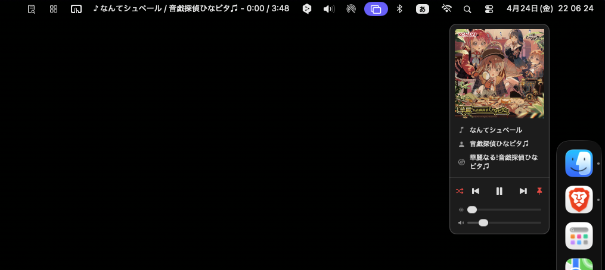

# menumusic

A small menu bar app for controlling Apple Music on macOS.
macOS のメニューバーから Music.app を操作する、小さな常駐アプリ。

**Distribution page / 配布ページ:** https://tonkie-butaoni.github.io/menumusic-release/
**Download / ダウンロード:** [menumusic.dmg](https://github.com/tonkie-butaoni/menumusic-release/releases/latest/download/menumusic.dmg)



---

## English

A lightweight menu bar utility for Apple Music on macOS. Designed for users who manage their library through playlists.

### Features

- **Menu bar display** — Shows current track, artist, album, and elapsed time. Each field can be toggled on/off independently.
- **Playback controls** — Left-click to open a panel with play/skip/seek/volume.
- **Now playing notifications** — Subtle popup with artwork when the track changes.
- **Loop modes** — Off / one / all.
- **Right-click menu** — Display options, always-on-top, menu size, playlists.

### Install

1. Download `menumusic.dmg`, mount it, drag `menumusic.app` into `/Applications`.
2. **Right-click** (or control-click) `menumusic.app` in Finder → **Open**. macOS will warn that the app is from an unidentified developer — click **Open** anyway. (Required only the first time.)
3. A music note icon appears in the menu bar. Play something in Music.app.

### Requirements

- macOS 13.0 or later
- Apple Silicon or Intel (Universal binary)
- Music.app

### Notes

- Unsigned (no Apple Developer ID). If macOS reports the app as "damaged", run:
  ```
  xattr -cr /Applications/menumusic.app
  ```
- The app's UI is in **English** when your system language is not Japanese, otherwise in Japanese (v0.5.1+).

---

## 日本語

Music.app でプレイリスト運用をメインにしている方向けの、軽量なメニューバー常駐アプリです。

### できること

- **メニューバー表示** — 再生中の曲名・アーティスト・アルバム名・経過時間を 1 行で表示。表示項目はそれぞれオン / オフ切替。
- **再生コントロール** — 左クリックで操作パネル（再生 / スキップ / シーク / 音量）。
- **通知パネル** — 曲が変わるとアートワーク付きでふわっと表示、自動消去。
- **ループ切替** — オフ / 1 曲 / 全曲。
- **右クリックメニュー** — 表示項目・常に最前面・メニューサイズ・プレイリスト一覧。

### インストール

1. `menumusic.dmg` をダウンロード→マウントし、`menumusic.app` を `アプリケーション` フォルダにドラッグ。
2. Finder で `menumusic.app` を **右クリック**（または control + クリック）→ **「開く」**。「開発元を確認できないため開けません」と警告が出ますが、そのまま「開く」を押してください（初回のみ必要）。
3. メニューバーに♪アイコンが出ます。Music.app で曲を再生してください。

### 動作環境

- macOS 13.0 以降
- Apple Silicon / Intel（Universal Binary）
- Music.app

### 補足

- Apple の開発者署名はしていません。「壊れている」と表示される場合はターミナルで以下を実行してください:
  ```
  xattr -cr /Applications/menumusic.app
  ```
- v0.5.1 以降、システム言語が日本語以外の場合は UI が英語になります。

詳細・トラブルシュートは [配布ページ](https://tonkie-butaoni.github.io/menumusic-release/) を参照してください。

---

Made by [tonkie](https://x.com/tonkie_butaoni).
